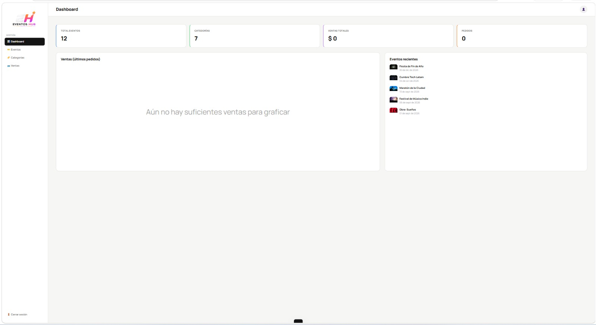

# #  EventosHub

¡Bienvenido a **EventosHub**! Una plataforma web moderna, interactiva y completamente responsiva diseñada para la búsqueda, filtrado, gestión, análisis de ventas y simulación de compra de entradas para todo tipo de eventos culturales, musicales y académicos.

Este proyecto fue desarrollado de forma colaborativa enfocado en brindar una experiencia de usuario fluida (*UX/UI*) y una arquitectura modular en JavaScript vainilla con persistencia en el almacenamiento local (`LocalStorage`).

---

## 🚀 Características Principales

- **Exploración Interactiva**: Catálogo dinámico cargado desde módulos de datos JSON (`eventos.json`, `categorias.json`, `ciudades.json`).
- **Filtrado Avanzado**: Búsqueda en tiempo real por categorías y ciudades para encontrar eventos específicos de forma instantánea.
- **Sección de Categorías**: Módulo especializado para navegar por los eventos agrupados por sus respectivas temáticas de forma intuitiva.
- **Carrito de Compras**: Añade entradas al carrito, gestiona cantidades y visualiza el desglose de precios en tiempo real.
- **Módulo de Ventas**: Panel de control donde se registran y procesan los reportes de transacciones, ingresos y tickets vendidos.
- **Panel Administrativo (Dashboard)**: Gestión completa de eventos, visualización de estadísticas y control de usuarios registrados.
- **Diseño Mobile-First & Responsivo**: Interfaz adaptada al 100% para dispositivos móviles y de escritorio mediante hojas de estilos dinámicas.

---

## 📸 Capturas de Pantalla (Vistas de la Aplicación)

Para demostrar el enfoque híbrido y responsivo, a continuación se presentan las vistas principales tanto en escritorio como en dispositivos móviles:

### 1. Portal del Catálogo de Eventos
La pantalla principal permite descubrir los eventos destacados del momento y filtrarlos con facilidad.

| Vista de Escritorio | Vista Móvil |
| :---: | :---: |
|  |  |

### 2. Explorador de Categorías
Segmentación y navegación intuitiva a través de los diferentes tipos de espectáculos y conferencias.

| Vista de Escritorio | Vista Móvil |
| :---: | :---: |
|  |  |

### 3. Carrito de Compras
Flujo simplificado para la verificación de entradas y simulación de pago.

| Vista de Escritorio | Vista Móvil |
| :---: | :---: |
|  |  |

### 4. Portal de Usuarios
Área dedicada al control, registro y perfil de las personas usuarias de la plataforma.

| Vista de Escritorio | Vista Móvil |
| :---: | :---: |
|  |  |

### 5. Control de Acceso Administrativo
Inicio de sesión seguro para el perfil administrador.

| Vista de Escritorio | Vista Móvil |
| :---: | :---: |
|  |  |

### 6. Panel Administrativo (Dashboard)
Panel de control integral para monitorear métricas clave del sistema y gestionar las bases de datos dinámicas.

| Vista de Escritorio | Vista Móvil |
| :---: | :---: |
|  |  |

### 7. Historial y Portal de Ventas
Área analítica para verificar las transacciones realizadas, ingresos brutos y control contable del boletaje.

| Vista de Escritorio | Vista Móvil |
| :---: | :---: |
|  |  |

---

## 🛠️ Tecnologías Utilizadas

El proyecto fue desarrollado utilizando estándares web modernos sin dependencias externas complejas:

- **HTML5**: Estructuración semántica de las interfaces.
- **CSS3**: Estilos personalizados utilizando variables, Flexbox, CSS Grid y Media Queries para la adaptación móvil (`responsive.css`).
- **JavaScript (ES6+)**: Lógica e interactividad modularizada:
  - `storage.js`: Controlador centralizado para manipulación del almacenamiento.
  - `filtradociudades.js`: Algoritmia de filtrado y consultas ágiles.
  - `components.js`: Elementos reutilizables de la UI.
- **JSON**: Almacenamiento local semilla (`data-seed.js`) para simular respuestas de bases de datos.

---

## 📂 Estructura del Proyecto

```text
├── index .html               # Portal principal orientado a clientes
├── admin.html                # Panel operativo del administrador
├── css/
│   ├── styles.css            # Estilos globales y layouts de escritorio
│   └── responsive.css        # Breakpoints específicos para smartphones y tablets
├── js/
│   ├── main.js               # Hilo principal de inicialización de la app
│   ├── admin.js              # Lógica operativa del panel de control
│   ├── components.js         # Componentes dinámicos e inyección HTML
│   ├── filtradociudades.js   # Manejo de filtros y búsquedas locativas
│   ├── storage.js            # Interfaz de persistencia (LocalStorage)
│   └── data-seed.js          # Inyección de datos semilla iniciales
└── assent/
    ├── data/                 # Archivos JSON de configuración (eventos, categorías, ciudades)
    └── imagen/               # Repositorio de recursos multimedia y capturas del sistema
